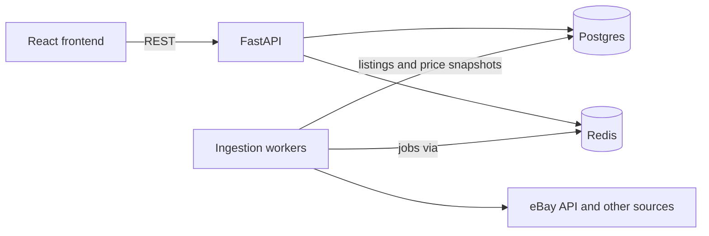

# Homelab-Designer

> PCPartPicker for homelabs: plan server builds, compare used hardware, and know what it'll cost to run 24/7.


## Why

PCPartPicker is great for consumer desktops, but it doesn't cover server hardware, mini PCs, or the used market, which is where most homelab builds come from. Finding a good used Dell R730 or a set of RDIMMs means juggling eBay tabs, compatibility forums, and spec sheets, then guessing at your power bill.

Homelab-Designer brings that into one place.

## Features

- **Prebuilt or custom builds.** Start from a mini PC, a used office desktop, or an enterprise server, or build from individual parts. Rack planning is optional.
- **Power cost estimates.** Idle and load wattage shown as a range, converted into monthly and yearly cost at your electricity rate.
- **Used listings with price history.** See the current price range and how prices have moved over time.
- **Listing risk filter.** A slider hides risky listings, with reasons shown for every flag (low seller feedback, price far below market, "untested / as-is" wording, stock photos only).
- **Compatibility warnings.** Catches common mismatches such as RDIMM vs. UDIMM, socket, BIOS requirements, and vendor-locked parts, and suggests checks like running SMART tests on used drives.

## Tech Stack

| Layer | Technology |
| --- | --- |
| Frontend | React, TypeScript |
| API | Python, FastAPI, Pydantic |
| Database | PostgreSQL (Supabase), SQLAlchemy, Alembic |
| Workers | Python background jobs (arq/Celery), eBay Browse API, Playwright |
| Cache / Queue | Redis |
| Testing / CI | pytest, GitHub Actions |
| Local dev | Docker Compose |

## Architecture



The app keeps a **canonical parts catalog** with normalized specs, and ingestion workers periodically attach **listing and price snapshots** to catalog parts. Compatibility checks run against structured specs rather than raw listing titles, and price history comes from stored snapshots. Scraping and API ingestion never run inside a user request.

## Getting Started

> Setup instructions will be finalized as the project is scaffolded.

### Prerequisites

- Docker and Docker Compose
- Python 3.12+
- Node.js 20+

### Local development

```bash
git clone <repo-url>
cd homelab-parts-finder

# Configure environment variables
cp .env.example .env

# Start Postgres and Redis
docker compose up -d

# Backend
cd backend
pip install -r requirements.txt
alembic upgrade head
uvicorn app.main:app --reload

# Frontend (in a new terminal)
cd frontend
npm install
npm run dev
```

### Running tests

```bash
cd backend
pytest
```

## Project Structure

```
backend/    FastAPI app, models, migrations
worker/     Ingestion jobs and listing processing
frontend/   React + TypeScript client
```

## Roadmap

**MVP**
- [ ] Repo scaffold and local Docker setup
- [ ] Authentication
- [ ] Parts catalog schema with seed data (prebuilts, CPUs, RAM)
- [ ] eBay ingestion and price snapshots
- [ ] Price history charts
- [ ] Power cost calculator
- [ ] Listing risk flags
- [ ] Tests, CI, and public deployment

**v2**
- [ ] AI-assisted matching of listings to catalog parts
- [ ] Full custom-build compatibility engine
- [ ] Additional listing sources

**v3**
- [ ] Rack planning
- [ ] Service planner for Docker, Kubernetes, Plex, and more
- [ ] Crowd-sourced idle power measurements

## License

TBD